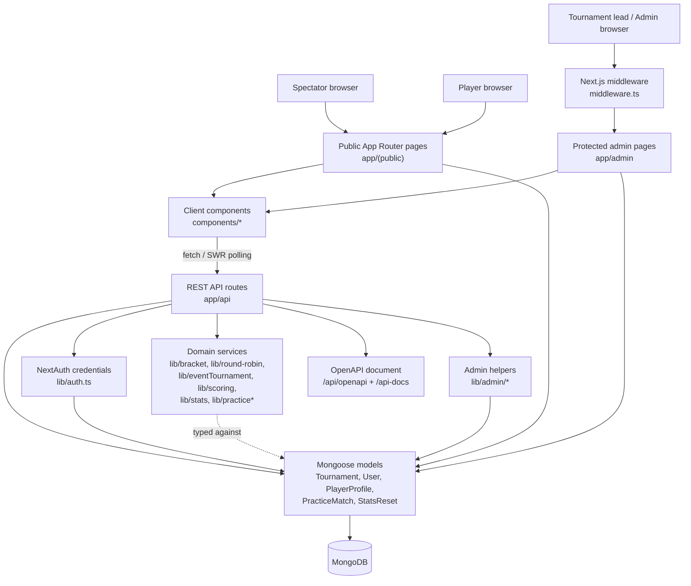
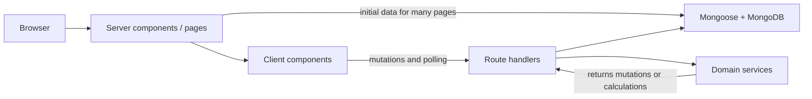
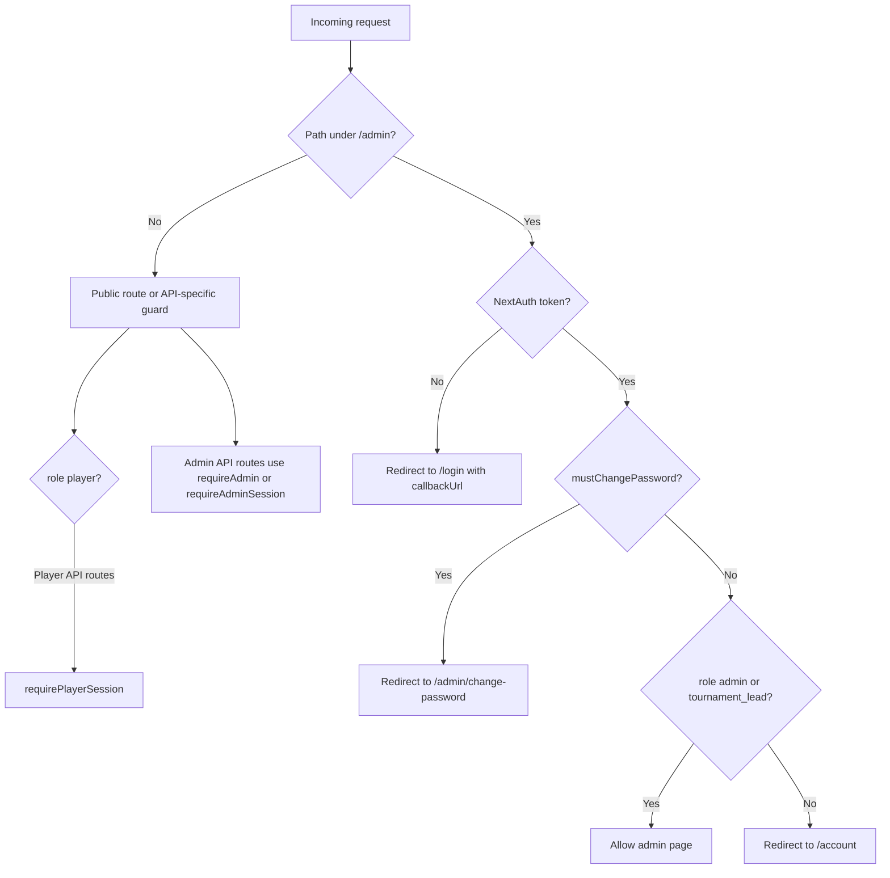
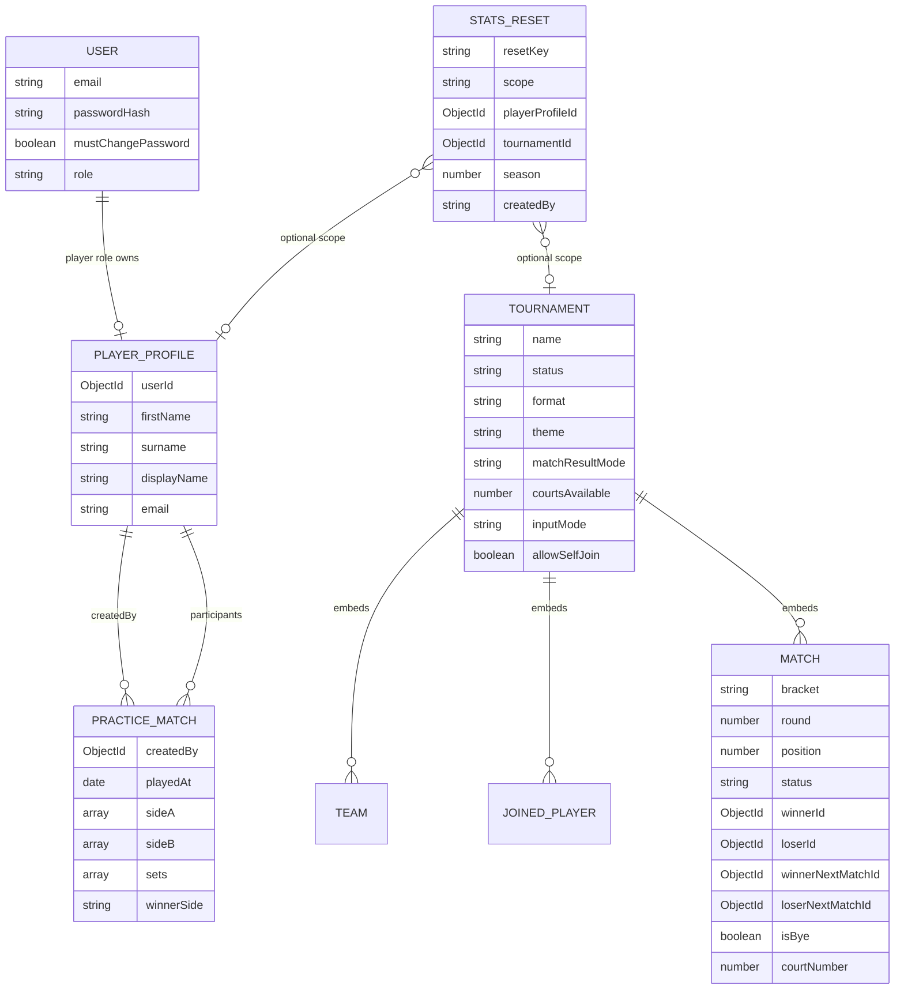
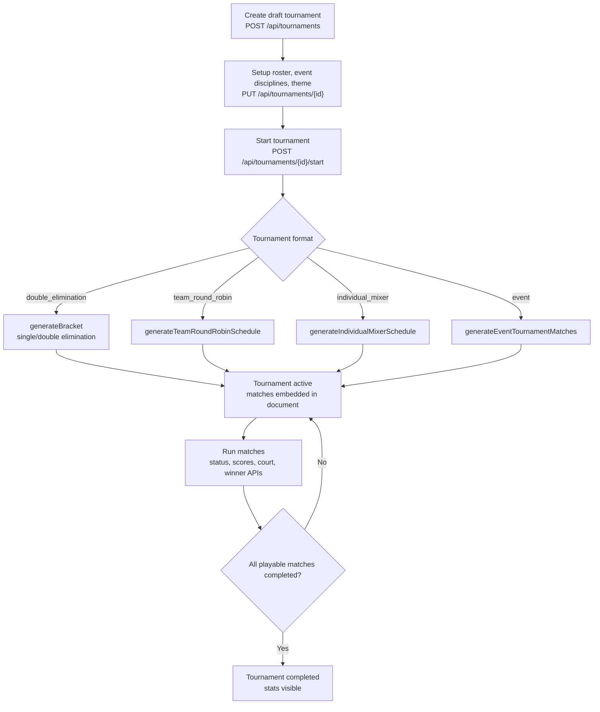
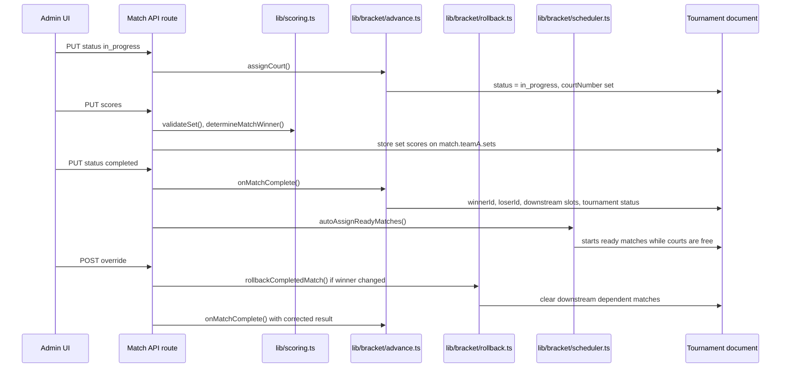
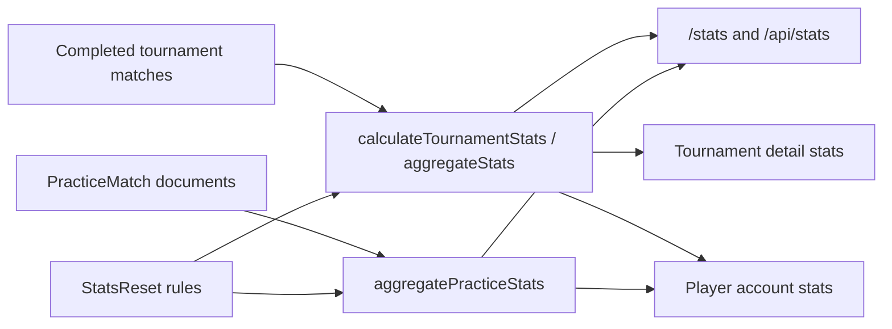
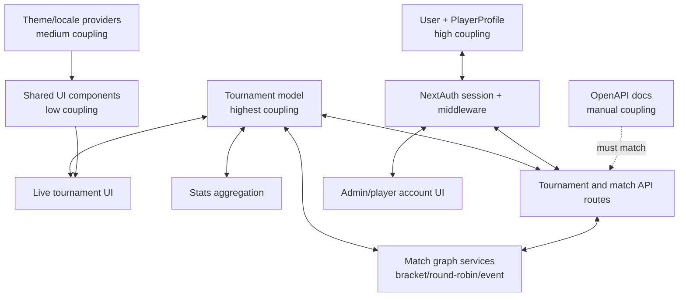

# Architecture

This document describes the current architecture of the Raro Volleyball Tournament Builder repository. It focuses on the main runtime layers, project functionality, data flow, and coupling points that matter when extending the application.

## System Overview

The project is a single Next.js App Router application. It serves public spectator/player pages, protected organizer/admin pages, and REST API routes from the same codebase. MongoDB is accessed through Mongoose models. NextAuth credentials auth provides role-aware sessions.

## Source Map

| Area | Responsibility |
| --- | --- |
| `app/(public)` | Public tournament list, tournament detail, stats, login, signup, and player account pages. |
| `app/admin` | Protected dashboard, tournament creation, setup, live management, and password-change pages. |
| `app/api` | REST API for auth/signup, tournaments, matches, stats, practice matches, player lookup, admin accounts, password reset, and OpenAPI. |
| `components/admin` | Admin dashboard panels, setup form, live match controls, score entry, court override, account management, and stats reset UI. |
| `components/bracket` | Knockout bracket rendering, match cards, standings, crests, public tournament view, polling state, and shared bracket utilities. |
| `components/event` | Event tournament display and winner-only event match interactions. |
| `components/player` | Signup, account, self-join, registered player picker, and practice match UI. |
| `components/stats` | Tournament/global statistics tables. |
| `components/ui` | Shared design system, layout/navigation, locale/theme providers, status badges, toasts, fields, cards, and buttons. |
| `lib/models` | Mongoose schemas and TypeScript types for persisted entities. |
| `lib/bracket` | Knockout graph generation, winner/loser advancement, rollback, court scheduling, labels, and player-to-team assignment. |
| `lib/round-robin` | Team round-robin and individual mixer schedule generation. |
| `lib/eventTournament.ts` | Multi-discipline event draw generation, slot planning, winner toggling, and event-specific advancement. |
| `lib/scoring.ts` | Set validation and match-winner calculation. |
| `lib/stats.ts`, `lib/practiceStats.ts` | Tournament and practice-stat aggregation with reset rules. |
| `lib/auth.ts`, `lib/adminAuth.ts`, `middleware.ts` | NextAuth setup, session role helpers, and `/admin` route protection. |
| `lib/openapi.ts` | Static OpenAPI 3.1 document served by `/api/openapi`. |
| `__tests__` | Vitest and React Testing Library coverage mirroring API, components, models, middleware, and domain libraries. |

## Runtime Boundaries

Most pages load initial data on the server, then hand it to client components. Live tournament views use SWR polling against `/api/tournaments/{id}` every 5 seconds until the tournament is completed. Admin controls mutate API routes and refresh the local SWR cache.

## Access Model

Roles are stored on `User.role`:

| Role | Main capabilities |
| --- | --- |
| `admin` | Full admin dashboard, tournament operations, tournament-lead account creation/deletion, player account management, password reset, and stats reset. |
| `tournament_lead` | Protected organizer access through the shared admin guard. In the current code this includes routes guarded only by `requireAdmin()`, but tournament-lead account creation/deletion has explicit `admin` checks. |
| `player` | Player account, self-join tournaments, and practice match management. |
| unauthenticated spectator | Public tournament list/detail and public stats. |

## Data Model

Tournament state is mostly embedded inside one `Tournament` document. That makes reads simple for live views, but it also makes the `Tournament` shape the central contract between models, API routes, bracket services, stats, and UI components.

## Main Functionality

### Tournament Lifecycle

Tournament formats:

| Format | Generator | Result mode | Notes |
| --- | --- | --- | --- |
| `double_elimination` | `lib/bracket/generate.ts` | points or winner-only | Can act as single elimination through `knockoutBracketType`. Supports random/manual first round and best-of-one or best-of-three late rounds. |
| `team_round_robin` | `lib/round-robin/teamSchedule.ts` | points | Every team plays every other team once. Can use generated teams from player input. |
| `individual_mixer` | `lib/round-robin/individualMixer.ts` | points | Rotates individual players into temporary teams by round. |
| `event` | `lib/eventTournament.ts` | winner-only | Runs multiple single-elimination disciplines in parallel on one court and plans playable slots without participant conflicts. |

### Match Operation Flow

Winner-only event matches use a separate endpoint, `/api/tournaments/{id}/event/matches/{matchId}/winner`, and `toggleEventMatchWinner()` because event tournaments need click-to-select behavior and event-specific slot planning.

### Statistics

Stats are calculated from persisted match results instead of being stored as counters. `StatsReset` records exclusion rules by player, tournament, season, or all data.

## API Surface

| Route group | Key routes | Responsibility |
| --- | --- | --- |
| Auth | `POST /api/auth/signup`, `/api/auth/[...nextauth]` | Player signup and NextAuth credential sessions. |
| Tournaments | `GET/POST /api/tournaments`, `GET/PUT/DELETE /api/tournaments/{id}`, `POST /start`, `POST /join` | Tournament creation, setup, start, public read, deletion, and self-join. |
| Matches | `PUT /matches/{matchId}/status`, `/scores`, `/court`, `POST /override` | Live match status, score entry, manual court assignment, result correction. |
| Events | `PUT /event/matches/{matchId}/winner` | Winner-only selection and deselection for event tournaments. |
| Stats | `GET /api/stats`, `GET /api/tournaments/{id}/stats`, `POST /api/admin/stats/reset` | Global/tournament stat reads and admin reset rules. |
| Practice | `GET/POST /api/practice-matches`, `PUT/DELETE /api/practice-matches/{id}` | Player-owned practice match CRUD. |
| Admin accounts | `GET/POST /api/admin/users`, `DELETE /api/admin/users/{id}`, `GET/POST /api/admin/players`, `POST /reset-password` | Tournament lead and player account administration with temporary passwords. |
| Documentation | `GET /api/openapi`, `/api-docs` | Static OpenAPI document and interactive docs page. |

## Coupling Map

| Coupling point | Coupled code | Why it exists | Risk when changing |
| --- | --- | --- | --- |
| `Tournament` document shape | `lib/models/Tournament.ts`, API routes, `lib/bracket/*`, `lib/eventTournament.ts`, `lib/stats.ts`, bracket/admin/event components | Tournament state is embedded for fast live reads and simple persistence. | Any field rename or enum change can break API serialization, UI rendering, schedule generation, and stats. Update tests broadly. |
| `IMatch.status` lifecycle | Match APIs, `advance.ts`, `scheduler.ts`, `rollback.ts`, `EventTournamentView`, `MatchControls`, `ScoreEntry` | Status drives UI buttons, court usage, scoring eligibility, advancement, and polling behavior. | Adding a status requires API validation, UI states, scheduler behavior, and stats filtering updates. |
| Scoring set format | `lib/scoring.ts`, `Tournament` match slots, `PracticeMatch`, score APIs, stats aggregators, score UI | The same set rules are reused for tournament and practice matches. | New score rules or point targets must be reflected in validation, OpenAPI, tests, stats, and UI labels. |
| Role strings | `User.role`, `lib/auth.ts`, `lib/adminAuth.ts`, `middleware.ts`, admin/player pages, tests | NextAuth session role controls route access and UI behavior. | New roles require session typing, middleware branches, helper changes, and component visibility updates. |
| Player identity | `User`, `PlayerProfile`, `joinedPlayers`, `team.playerProfileIds`, practice participants, stats keys | Stats and self-join need stable player profile IDs but still support display names. | Identity migration is sensitive. Keep name normalization and profile ID keys aligned. |
| Theme and locale keys | `lib/i18n.ts`, `lib/theme.ts`, providers, layout startup scripts, UI components | Locale/theme are applied before hydration and consumed by client components. | Storage key or translation-key changes can cause hydration mismatch or missing labels. |
| OpenAPI document | `lib/openapi.ts` and route handlers | API docs are manually maintained. | Route payload changes can drift from docs unless OpenAPI is updated with implementation changes. |

### Coupling Strength

## Change Guidance

### Adding a Tournament Format

Update these areas together:

1. Add the format enum/value in `lib/models/Tournament.ts`.
2. Extend creation validation in `app/api/tournaments/route.ts`.
3. Add the start-generation branch in `app/api/tournaments/[id]/start/route.ts`.
4. Add a scheduler/generator in `lib/` or reuse an existing one.
5. Render it in `PublicTournamentView` and `TournamentManageView`.
6. Decide how stats should count it in `lib/stats.ts`.
7. Update `lib/openapi.ts`, setup/create UI, and tests under `__tests__/api`, `__tests__/lib`, and `__tests__/components`.

### Changing Match Scoring

Change `lib/scoring.ts` first, then update all consumers:

1. Tournament score APIs and winner-only completion behavior.
2. Practice match payload parsing and Mongoose validation.
3. `ScoreEntry`, `MatchControls`, and related component tests.
4. Stats aggregation if points or sets should be interpreted differently.
5. OpenAPI schemas for score sets and requests.

### Changing Authorization

Role and first-login behavior spans both server and client:

1. `User.role` enum and NextAuth session fields.
2. `types/next-auth.d.ts`.
3. `lib/adminAuth.ts` helper semantics.
4. `middleware.ts` redirects and allowed admin paths.
5. Admin sidebar/navbar visibility and page-level guards.
6. API route authorization tests.

## Validation and Build

The repository uses:

| Command | Purpose |
| --- | --- |
| `npm run lint` | ESLint checks. |
| `npm run typecheck` | TypeScript type check without emit. |
| `npm run test` | Vitest test suite. |
| `npm run test:coverage` | Coverage run. |
| `npm run build` | Next.js production build. |

Development should stay test-driven. For code changes, add or update tests before implementation. Documentation-only changes like this file normally do not require a test run, but the full verification command set is still the deployment gate.
